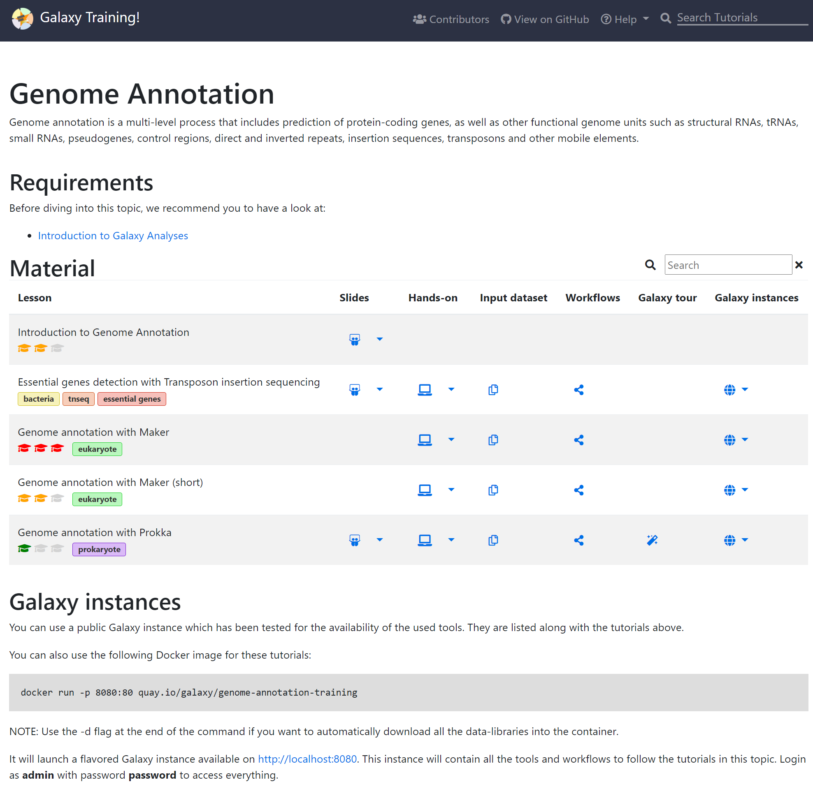

# Galaxy

## [Galaxy Training!](https://training.galaxyproject.org/training-material/)

世界中のGalaxyコミュニティによって開発および保守されているチュートリアルのコレクションです。

下記の画像ように各トピック毎のトレーニングマテリアルへのリンクがまとめられています。

画像のテーブルの各列の意味は下記になります。

- Slides: ...
- Hands-on: ...
- Input dataset: ...
- Workflows: ...
- Galaxy tour: ...
- Galaxy instances: ...
